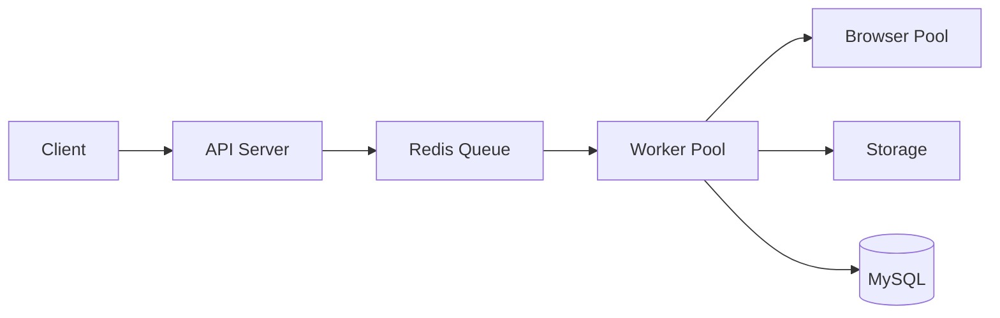
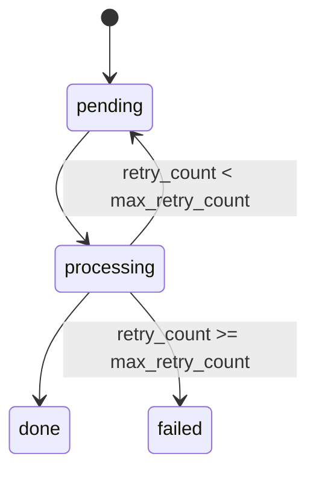
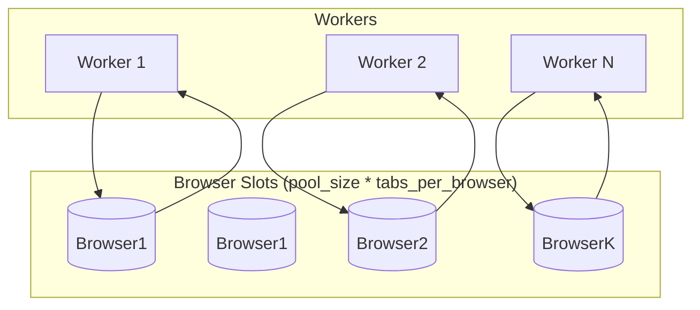

### 并发模型设计

本项目采用“异步队列 + Worker Pool + Browser Pool”的分层并发控制模型，目标是在保证吞吐的同时，控制浏览器资源消耗并提高稳定性。

#### 1. 处理链路

1. 客户端提交截图请求，API 生成 `task_id` 并返回。  
2. 任务写入 Redis 队列，状态为 `pending`。  
3. Worker Pool 持续消费任务，状态更新为 `processing`。  
4. Worker 在执行截图前，从 Browser Pool 获取浏览器实例槽位。  
5. 截图完成后写入存储，更新任务状态为 `done`；失败则进入重试或 `failed`。  

#### 2. Worker Pool 设计

- `WORKER_COUNT` 决定 worker goroutine 数量。  
- 每个 worker 通过循环持续消费任务。  
- 优雅停机时由 `context` 取消，worker 退出并等待 in-flight 任务结束。  
- 失败任务根据 `MAX_RETRY_COUNT` 进行重试，超过上限后标记 `failed`。  

任务状态流转：

#### 3. Browser Pool 设计

- `BROWSER_POOL_SIZE`：浏览器实例数量（Chrome 进程数）。  
- `MAX_TABS_PER_BROWSER`：每个实例允许的并发 tab 槽位。  
- 总截图并发槽位：`BROWSER_POOL_SIZE * MAX_TABS_PER_BROWSER`。  
- 每次截图流程：`Acquire槽位 -> Capture -> Release槽位`。  

#### 4. 并发上限计算

系统有效并发通常受以下最小值约束：

`effective_concurrency = min(WORKER_COUNT, BROWSER_POOL_SIZE * MAX_TABS_PER_BROWSER)`

并叠加硬件与外部依赖限制（CPU/内存、目标站点响应、Redis/MySQL、存储 IO）。

---

### 关键参数推荐

| 场景 | WORKER_COUNT | BROWSER_POOL_SIZE | MAX_TABS_PER_BROWSER | MAX_RETRY_COUNT | SHOT_TIMEOUT_SEC | TASK_TIMEOUT_SEC |
|---|---:|---:|---:|---:|---:|---:|
| 本地开发 | 4 | 1 | 1 | 1 | 20 | 30 |
| 小流量线上 | 8 | 2 | 1 | 2 | 30 | 45 |
| 中流量线上 | 12 | 3 | 2 | 2 | 30 | 60 |

调参建议：
1. 队列堆积且 CPU 不高：优先增 `BROWSER_POOL_SIZE`。  
2. CPU/内存压力高且失败率上升：先降 `MAX_TABS_PER_BROWSER`。  
3. worker 长时间空闲：降低 `WORKER_COUNT` 或提升浏览器槽位。  
4. 超时失败多：适当增大 `TASK_TIMEOUT_SEC`，同时控制重试次数。  

---

### 当前实现特点

1. API 与执行层通过 Redis 队列解耦。  
2. Worker Pool 控制任务并发，具备重试与优雅停机能力。  
3. Browser Pool 实现浏览器实例复用与 tab 并发限流。  
4. 全链路支持结构化日志与指标观测（含请求与任务耗时）。